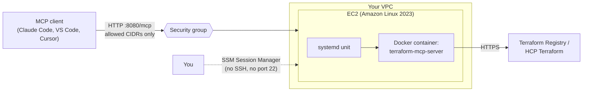

# terraform-aws-mcp-server-ec2

Terraform that deploys a remote [Model Context Protocol (MCP)](https://modelcontextprotocol.io) server on AWS EC2. It runs HashiCorp's open-source [`terraform-mcp-server`](https://github.com/hashicorp/terraform-mcp-server) in Docker behind systemd, so AI assistants can reach it over HTTP.

The design favors a small, locked-down footprint: one instance, no SSH, IMDSv2 only, an encrypted disk, and a security group that only admits the IP addresses you list.

## Architecture



## What gets created

| Resource | Purpose |
|---|---|
| `aws_instance` | Amazon Linux 2023 host, IMDSv2 required, encrypted gp3 root volume |
| `aws_security_group` + rules | Ingress on the MCP port only from `allowed_cidr_blocks`; egress limited to HTTPS |
| `aws_iam_role` + instance profile | `AmazonSSMManagedInstanceCore` so you can get a shell through Session Manager |
| `user_data` | Installs Docker and registers a systemd service that runs the MCP container |

## Prerequisites

- Terraform 1.6 or newer
- AWS credentials with permission to create the resources above
- An existing VPC and subnet (a public subnet if you want a public IP)
- The [Session Manager plugin](https://docs.aws.amazon.com/systems-manager/latest/userguide/session-manager-working-with-install-plugin.html) if you want shell access

## Quick start

```bash
git clone https://github.com/metalaranna/terraform-aws-mcp-server-ec2.git
cd terraform-aws-mcp-server-ec2

cp terraform.tfvars.example terraform.tfvars
# Edit vpc_id, subnet_id, and allowed_cidr_blocks (your IP as x.x.x.x/32)

terraform init
terraform plan
terraform apply
```

Find your VPC and subnet IDs if you need them:

```bash
aws ec2 describe-vpcs --query 'Vpcs[*].[VpcId,Tags[?Key==`Name`].Value|[0]]' --output table
aws ec2 describe-subnets --query 'Subnets[*].[SubnetId,VpcId,AvailabilityZone]' --output table
```

## Verify

Give the instance a minute or two to bootstrap, then:

```bash
curl "$(terraform output -raw health_url)"
```

Open a shell without SSH:

```bash
$(terraform output -raw ssm_session_command)
sudo systemctl status terraform-mcp-server
sudo docker logs terraform-mcp-server
```

## Connect a client

Example with Claude Code:

```bash
claude mcp add --transport http terraform "$(terraform output -raw mcp_endpoint)"
```

Other clients that support the streamable HTTP transport work the same way: point them at the `mcp_endpoint` output.

## Configuration

| Variable | Default | Description |
|---|---|---|
| `vpc_id` | required | VPC to deploy into |
| `subnet_id` | required | Subnet for the instance |
| `allowed_cidr_blocks` | required | CIDRs allowed to reach the server. `0.0.0.0/0` is rejected by a validation rule |
| `region` | `us-east-1` | AWS region |
| `instance_type` | `t3.small` | EC2 instance type |
| `mcp_image` | `hashicorp/terraform-mcp-server:1.3.0` | Container image. Pin a version tag |
| `mcp_port` | `8080` | Listening port |
| `root_volume_size_gb` | `20` | Encrypted root volume size |
| `associate_public_ip` | `true` | Assign a public IP |
| `tags` | `{}` | Extra tags |

## Security notes

- **Traffic is plain HTTP by default.** The security group restricts who can connect, but tokens sent to the server (for HCP Terraform or Terraform Enterprise) are not encrypted in transit. Before using real tokens, add TLS. The server supports `MCP_TLS_CERT_FILE` and `MCP_TLS_KEY_FILE`, or you can put an Application Load Balancer with an ACM certificate in front.
- **Keep `allowed_cidr_blocks` narrow.** Use `/32` addresses for individuals.
- **No SSH.** Access is through SSM Session Manager, which is logged in CloudTrail.
- **Untrusted clients.** HashiCorp notes that the server may expose Terraform data to the connected client and LLM, so only connect trusted clients.
- **Restrict browser origins** with `MCP_ALLOWED_ORIGINS` if you extend the user data script.

## Cost

One small EC2 instance, an EBS volume, and normal data transfer. Check current [EC2 pricing](https://aws.amazon.com/ec2/pricing/) for your region, and run `terraform destroy` when you are done experimenting.

## Cleanup

```bash
terraform destroy
```

## Roadmap

- [ ] Application Load Balancer with ACM certificate and HTTPS
- [ ] Auto Scaling group of one for self-healing
- [ ] CloudWatch agent and log shipping
- [ ] OpenTelemetry metrics (`OTEL_METRICS_ENABLED`) to a collector
- [ ] Optional private subnet deployment behind the load balancer

## Development

```bash
terraform fmt -recursive
terraform init -backend=false
terraform validate
```

The same checks run in GitHub Actions on every push and pull request.

## Credits

The MCP server itself is [hashicorp/terraform-mcp-server](https://github.com/hashicorp/terraform-mcp-server), licensed under MPL-2.0. This repository only provides AWS deployment code and is not affiliated with HashiCorp.

## License

MIT. See [LICENSE](LICENSE).
